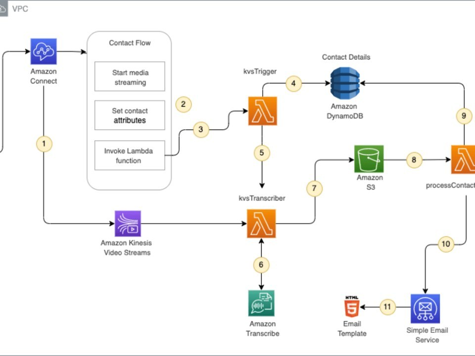

### Customized AWS Connect Voicemail Solution

### Role: Solutions Architect

### Description: Optimized resource usage for the AWS Voicemail solution

### Challenge:

The challenge was to optimize resource usage, reduce costs, and improve efficiency by providing a more straightforward and user-friendly system for the AWS services included involved in AWS services like Amazon S3, Amazon Lambda, Amazon Kinesis Video Streams, and Amazon Connect.

### Skills

Serverless Stack
Amazon Web Services
JavaScript / Node.js
Amazon S3, DynamoDB, Kinesis Video Streams, Transcribe
GitHub / Git

### More Info:

Client had a requirement for a customized AWS Connect Voicemail Solution that was more cost-efficient, streamlined, and simplified.

Worked closely with the client to understand their requirements and challenges and then created a custom solution that met all their needs.

To achieve this, I utilized AWS Connect and AWS Lambda, leveraging their power and flexibility to create a scalable and cost-effective solution. We first identified the key challenges in the existing voicemail system, such as complex configuration settings, high resource usage, and the use of a Java parser that transcribe the voicemails was very difficult to understand and maintain.

We then addressed these issues by developing a new parser in Node.JS/Typescript/Lambda that will transcribe the voicemail and send an mp3 file along with transcribed text to the suggested email in the Voicemail configuration block.

Overall, the Customized AWS Connect Voicemail Solution was a success, meeting all of Client's requirements and delivering a more streamlined and cost-efficient voicemail system.

### Solution

